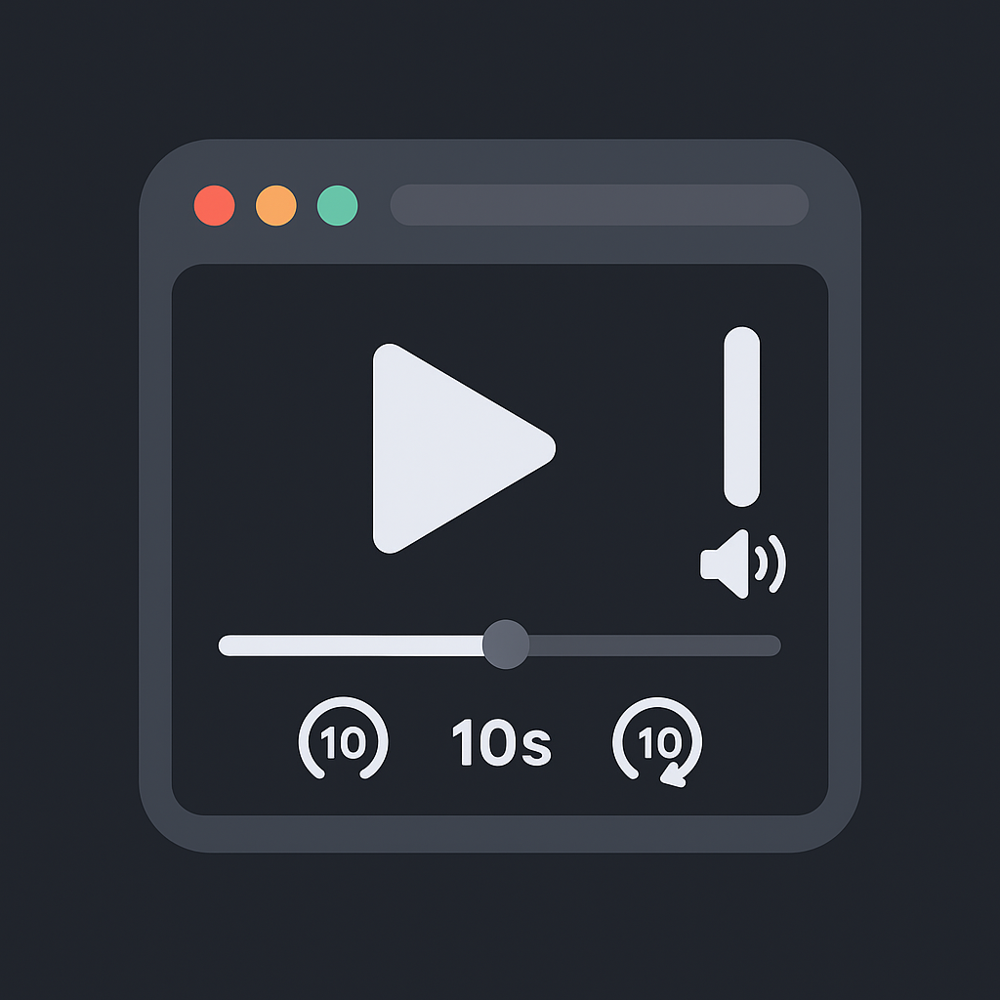

# Firefox Global Media Controller

<p align="center">
  
</p>

A Firefox extension that provides a unified media control interface for all tabs playing audio or video content. Similar to Chrome/Brave's media hub but designed specifically for Firefox.


## Features

- **Centralized Control**: Control all playing media from a single toolbar popup
- **Universal Compatibility**: Works with YouTube, Spotify Web, SoundCloud, podcasts, and any HTML5 media
- **Rich Controls**: Play/pause, seek ±10s, scrubber bar, volume/mute, and tab navigation
- **Keyboard Shortcuts**: Global shortcuts for play/pause and seeking
- **Real-time Updates**: Live progress tracking and state synchronization

## Installation

### Development Installation

1. Clone or download this repository
2. Open Firefox and go to `about:debugging`
3. Click "This Firefox" in the sidebar
4. Click "Load Temporary Add-on"
5. Navigate to the extension folder and select `manifest.json`

### From Firefox Add-ons (Future)

The extension will be available on the Firefox Add-ons store once reviewed and approved.

## Usage

1. **Access Controls**: Click the media controller icon in the toolbar
2. **Play/Pause**: Click the play/pause button or use `Ctrl+Shift+Space`
3. **Seek**: Use the ±10s buttons or shortcuts (`Ctrl+Shift+,` and `Ctrl+Shift+.`)
4. **Scrub**: Click anywhere on the progress bar to jump to that position
5. **Volume**: Use the volume slider or mute button
6. **Navigate**: Click the link button to switch to the media tab

## Supported Sites

The extension works with any website that uses HTML5 `<audio>` or `<video>` elements, including:

- YouTube & YouTube Music
- Spotify Web Player
- SoundCloud
- Netflix, Hulu, Prime Video
- Podcast sites
- News sites with video content
- Any site with embedded media

## Architecture

### Components

- **Background Script** (`background.js`): Session management and message routing
- **Content Script** (`mediaAgent.js`): Media element detection and control
- **Popup Interface** (`popup.html/js/css`): User interface for media control

### Key Features

- **Automatic Detection**: Finds audible tabs and injects media agents
- **Smart Element Selection**: Chooses the best media element per tab
- **Throttled Updates**: Efficient progress tracking without performance impact
- **Media Session Integration**: Uses Web API metadata when available

## Permissions

The extension requires these permissions:

- `tabs`: To detect audible tabs and manage playback
- `scripting`: To inject content scripts into media tabs
- `storage`: To save user preferences
- `activeTab`: To interact with the current tab
- `<all_urls>`: To work with media on any website

## Privacy

- **No Data Collection**: All processing happens locally in your browser
- **No Network Access**: The extension doesn't send any data to external servers
- **Minimal Storage**: Only user preferences are stored locally

## Development

### Project Structure

```
Firefox-Media-Controller/
├── manifest.json          # Extension manifest
├── background.js          # Background service worker
├── mediaAgent.js          # Content script for media control
├── popup.html            # Popup interface
├── popup.js              # Popup functionality
├── popup.css             # Popup styling
├── icons/                # Extension icons
└── README.md             # This file
```

### Building

No build process required - this is a standard WebExtension that runs directly in Firefox.

### Testing

1. Load the extension in Firefox
2. Open multiple tabs with different media content
3. Test controls, keyboard shortcuts, and edge cases
4. Verify compatibility with various video/audio sites

## Troubleshooting

### Media Not Detected

- Ensure the tab is audible (playing sound)
- Some sites may delay media element creation
- Refresh the tab and try again

### Controls Not Working

- Check if the media supports seeking (some live streams don't)
- Verify the site doesn't override media controls
- Try refreshing both the media tab and popup

### Performance Issues

- The extension throttles updates to minimize impact
- Close unused media tabs to reduce overhead
- Restart Firefox if issues persist

## Contributing

1. Fork the repository
2. Create a feature branch
3. Make your changes
4. Test thoroughly with different sites
5. Submit a pull request

## License

This project is licensed under the MIT License - see the LICENSE file for details.

## Roadmap

### Upcoming Features

- Picture-in-Picture integration
- Playback speed control
- Per-site volume memory
- Enhanced keyboard shortcuts
- Mini-player sidebar
- Site-specific features (YouTube next/prev, etc.)

### Known Limitations

- DRM content may have limited control options
- Some sites may override native media controls
- Live streams may not support seeking
- Background suspended tabs need manual refresh

## Changelog

### v0.1.0 (Current)

- Initial release
- Basic media detection and control
- Popup interface with play/pause, seek, volume
- Keyboard shortcuts
- Multi-tab support
- Firefox Manifest V3 compatibility