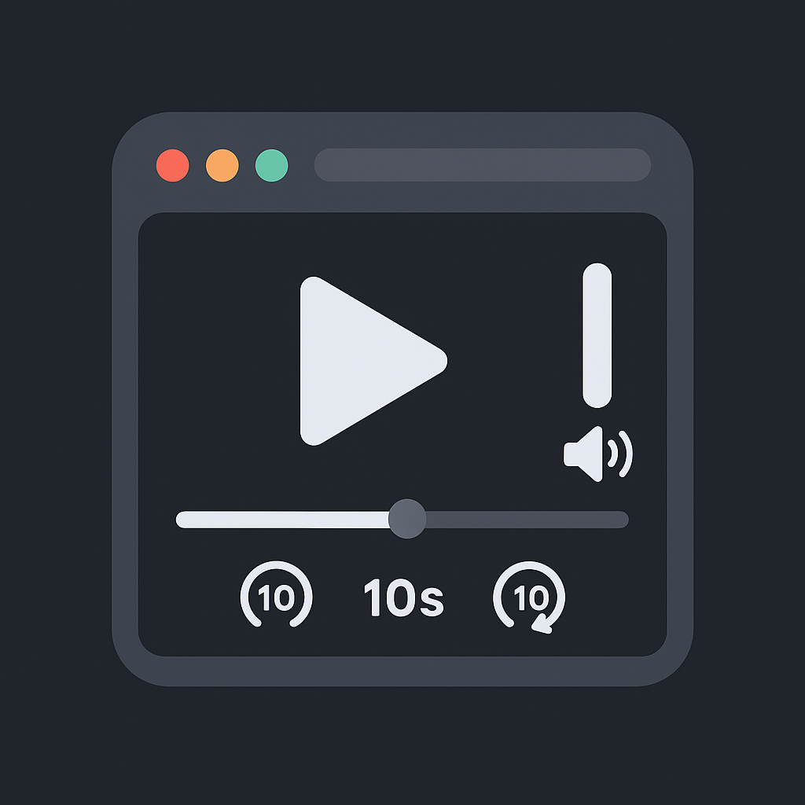

  

<h1 align="center">Global Media Controller</h1>

  A Firefox extension to control media playback across all tabs from a single popup — like Chrome's media hub, but for Firefox.

  
  
  
  

---

## Features

- **Unified controls** — play/pause, seek ±10s, scrubber, volume, mute, all in one popup
- **Multi-tab** — manages sessions across every audible tab simultaneously
- **Keyboard shortcuts** — `Ctrl+Shift+Space` to toggle, `Ctrl+Shift+,/. ` to seek
- **Works everywhere** — YouTube, Spotify, SoundCloud, Netflix, and any HTML5 media
- **No telemetry** — everything runs locally, nothing leaves your browser

## Installation

**Temporary (development)**

1. Go to `about:debugging` → This Firefox
2. Click **Load Temporary Add-on**
3. Select `manifest.json` from this repo

**From the store** — coming soon on [addons.mozilla.org](https://addons.mozilla.org)

## Keyboard Shortcuts

| Action | Shortcut |
|---|---|
| Play / Pause | `Ctrl+Shift+Space` |
| Seek forward 10s | `Ctrl+Shift+.` |
| Seek back 10s | `Ctrl+Shift+,` |

## Permissions

| Permission | Why |
|---|---|
| `tabs` | Detect audible tabs |
| `scripting` | Inject media agent into tabs |
| `storage` | Save preferences |
| `<all_urls>` | Work on any media site |

## Known Limitations

- DRM-protected content (Netflix, etc.) has limited seek support
- Live streams don't support seeking by design
- Suspended background tabs need a manual refresh to reconnect

## Contributing

PRs are welcome. Please test against YouTube, Spotify Web, and SoundCloud before submitting.

## License

MIT
